# Week 5 Assignment

## Task 2: Create database and table in MySQL server
### Create a new database named website
*SQL Statement*  

```MySql
create database website;
```


### Create a new table named member, in the website database, designed as below:
*SQL Statement*  

```MySql
create table member(id bigint, name varchar(255), username varchar(255), password varchar(255),follower_count int unsigned, time datetime);
```

  

*SQL Statement*  

```MySql
alter table member
    -> modify column name varchar(255) not null,
    -> modify column username varchar(255) not null,
    -> modify column password varchar(255) not null;
```  
```MySql
alter table member
    -> add primary key (id);
alter table member
    -> modify id bigint auto_increment;
```  

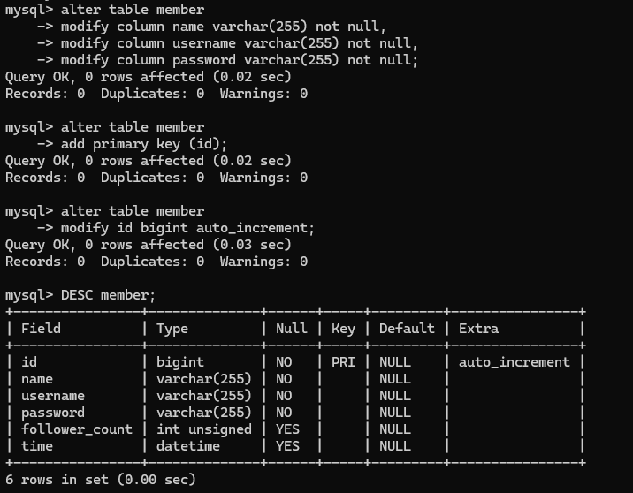  

*SQL Statement*  

```MySql
alter table member
    -> modify follower_count int unsigned not null default 0;
```  
```MySql
alter table member
    -> modify time datetime not null default current_timestamp;
```  

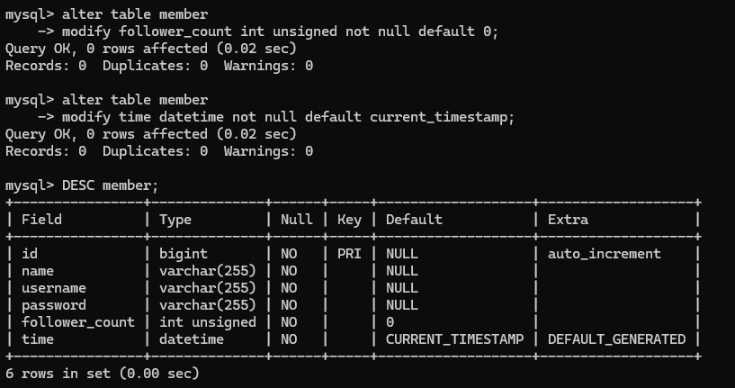  

## Task 3: SQL CRUD
### INSERT a new row to the member table where name, username and password must be set to test. INSERT additional 4 rows with arbitrary data.
*SQL Statement*  

```MySql
insert into member (name, username, password) values ('test', 'test', 'test');
```

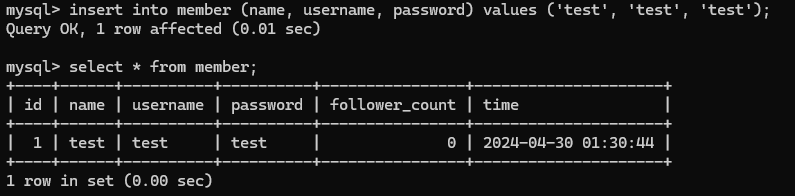  

*SQL Statement*  

```MySql
insert into member (name, username, password) values ('林小美', 'mei052277', 'qaz123');
insert into member (name, username, password) values ('WOOWOOOWOOOWOOOOWOO', 'OOWOOWOOOWOOW', '123456');
insert into member (name, username, password) values ('王大明是我的偶像', 'mingmingNO.1', 'frkofkro');
insert into member (name, username, password) values ('我很想試試看字串長度但還是不要整自己好了', '!@#$%^&*', '*&^%$#@!');
```

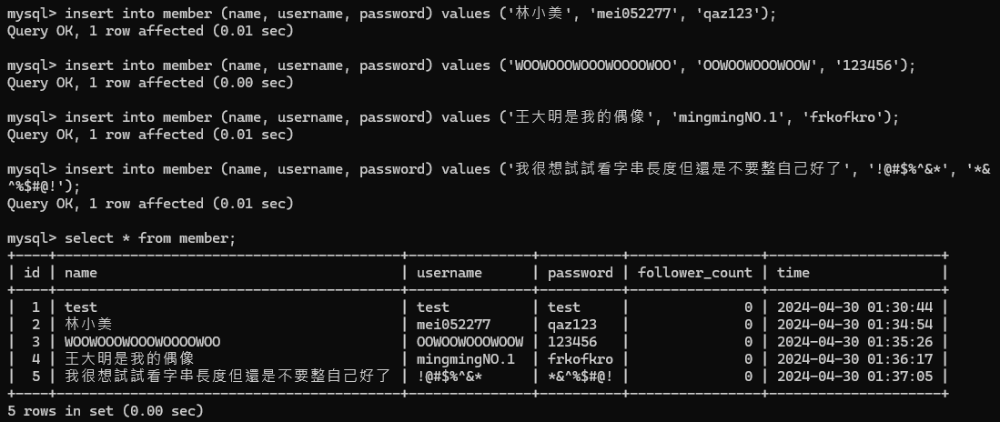  

### SELECT all rows from the member table.
*SQL Statement*  

```MySql
select * from member;
```

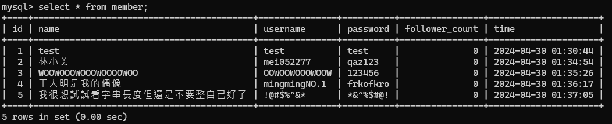  

### SELECT all rows from the member table, in descending order of time.
*SQL Statement*  

```MySql
select * from member order by time desc;
```

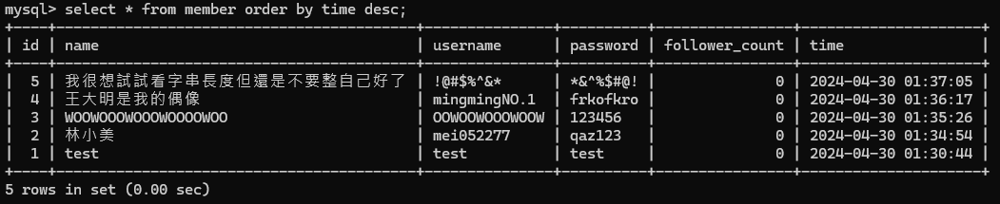  

### SELECT total 3 rows, second to fourth, from the member table, in descending order of time.
*SQL Statement*  

```MySql
select * from member order by time desc limit 1,3;
```

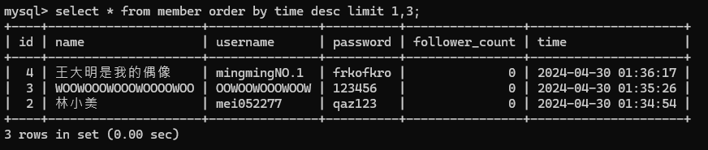  

### SELECT rows where username equals to test.
*SQL Statement*  

```MySql
select * from member where username = 'test';
```

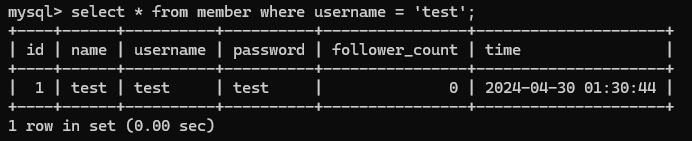  

### SELECT rows where name includes the es keyword.
*SQL Statement*  

```MySql
select * from member where username like '%es%';
```

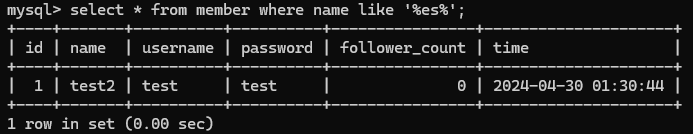  

### SELECT rows where both username and password equal to test.
*SQL Statement*  

```MySql
select * from member where username = 'test' and password = 'test';
```

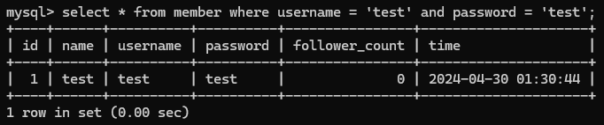  

### UPDATE data in name column to test2 where username equals to test.
*SQL Statement*  

```MySql
update member set name = 'test2' where username = 'test';
```

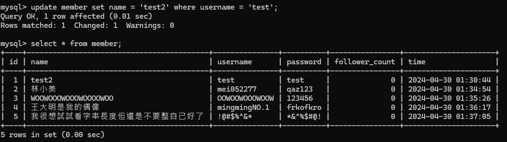  

## Task 4: SQL Aggregation Functions
### SELECT how many rows from the member table.


