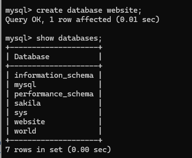
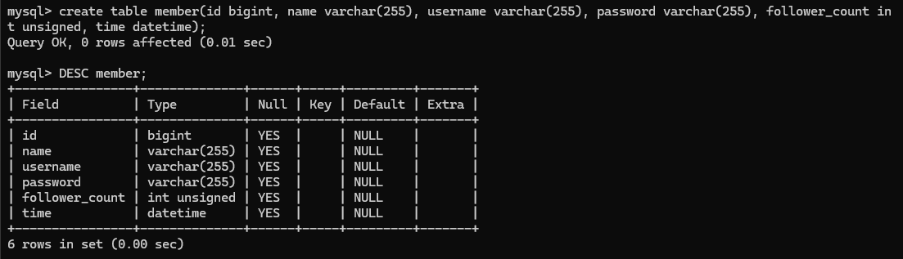

# Week 5 Assignment

## Task 2: Create database and table in MySQL server
### Create a new database named website
*SQL Statement*  

```MySql
create data base website;
```



### Create a new table named member, in the website database, designed as below:
*SQL Statement*  

```MySql
create table member(id bigint, name varchar(255), username varchar(255), password varchar(255),follower_count int unsigned, time datetime);
```

  

## Task 3: SQL CRUD
### INSERT a new row to the member table where name, username and password must be set to test. INSERT additional 4 rows with arbitrary data.

