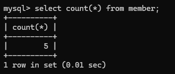
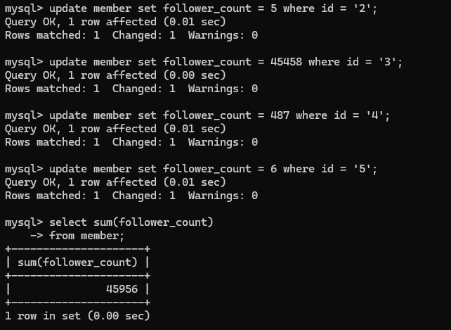
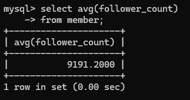
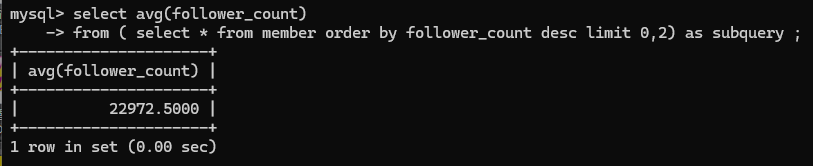
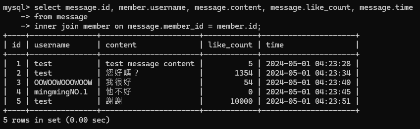
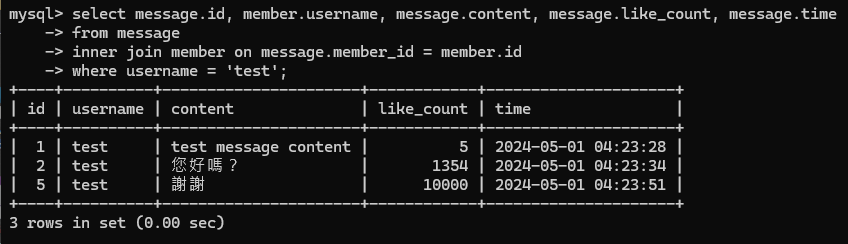
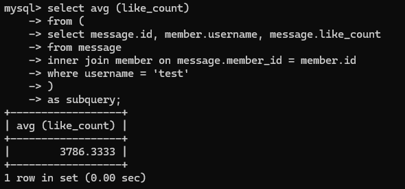

# Week 5 Assignment

## Task 2: Create database and table in MySQL server
### Create a new database named website
*SQL Statement*  

```MySql
create database website;
```


### Create a new table named member, in the website database.
*SQL Statement*  

```MySql
create table member(id bigint, name varchar(255), username varchar(255), password varchar(255),follower_count int unsigned, time datetime);
```

  

*SQL Statement*  

```MySql
alter table member
    -> modify column name varchar(255) not null,
    -> modify column username varchar(255) not null,
    -> modify column password varchar(255) not null;
```  
```MySql
alter table member
    -> add primary key (id);
alter table member
    -> modify id bigint auto_increment;
```  

  

*SQL Statement*  

```MySql
alter table member
    -> modify follower_count int unsigned not null default 0;
```  
```MySql
alter table member
    -> modify time datetime not null default current_timestamp;
```  

  

## Task 3: SQL CRUD
### INSERT a new row to the member table where name, username and password must be set to test. INSERT additional 4 rows with arbitrary data.
*SQL Statement*  

```MySql
insert into member (name, username, password) values ('test', 'test', 'test');
```

  

*SQL Statement*  

```MySql
insert into member (name, username, password) values ('林小美', 'mei052277', 'qaz123');
insert into member (name, username, password) values ('WOOWOOOWOOOWOOOOWOO', 'OOWOOWOOOWOOW', '123456');
insert into member (name, username, password) values ('王大明是我的偶像', 'mingmingNO.1', 'frkofkro');
insert into member (name, username, password) values ('我很想試試看字串長度但還是不要整自己好了', '!@#$%^&*', '*&^%$#@!');
```

  

### SELECT all rows from the member table.
*SQL Statement*  

```MySql
select * from member;
```

  

### SELECT all rows from the member table, in descending order of time.
*SQL Statement*  

```MySql
select * from member order by time desc;
```

  

### SELECT total 3 rows, second to fourth, from the member table, in descending order of time.
*SQL Statement*  

```MySql
select * from member order by time desc limit 1,3;
```

  

### SELECT rows where username equals to test.
*SQL Statement*  

```MySql
select * from member where username = 'test';
```

  

### SELECT rows where name includes the es keyword.
*SQL Statement*  

```MySql
select * from member where username like '%es%';
```

  

### SELECT rows where both username and password equal to test.
*SQL Statement*  

```MySql
select * from member where username = 'test' and password = 'test';
```

  

### UPDATE data in name column to test2 where username equals to test.
*SQL Statement*  

```MySql
update member set name = 'test2' where username = 'test';
```

  

## Task 4: SQL Aggregation Functions
### SELECT how many rows from the member table.
*SQL Statement*  

```MySql
select count(*) from member;
```

  

### SELECT the sum of follower_count of all the rows from the member table.
*SQL Statement*  

```MySql
update member set follower_count = 5 where id = '2';
update member set follower_count = 45458 where id = '3';
update member set follower_count = 487 where id = '4';
update member set follower_count = 6 where id = '5';
```

```MySql
select sum(follower_count)
    -> from member;
```

  

### SELECT the average of follower_count of all the rows from the member table.
*SQL Statement*  

```MySql
select avg(follower_count)
    -> from member;
```

  

###  SELECT the average of follower_count of the first 2 rows, in descending order of follower_count, from the member table.
*SQL Statement*  

```MySql
select avg(follower_count)
    -> from ( select * from member order by follower_count desc limit 0,2) as subquery ;
```

  

## Task 5:  SQL JOIN
### Create a new table named message, in the website database.
*SQL Statement*  

```MySql
create table message (id bigint primary key, member_id bigint, content varchar(255), like_count int unsigned, time datetime);
```  

```MySql
alter table message
    -> modify id bigint auto_increment;
alter table message
    -> modify member_id bigint not null;
alter table message
    -> modify content varchar(255) not null;
alter table message
    -> modify like_count int unsigned not null default 0;
alter table message
    -> modify time datetime not null default current_timestamp;
```

```MySql
insert into message (member_id, content, like_count) values ('1', 'test message content', '5');
insert into message (member_id, content, like_count) values ('1', '您好嗎？', '1354');
insert into message (member_id, content, like_count) values ('3', '我很好', '54');
insert into message (member_id, content, like_count) values ('4', '他不好', '0');
insert into message (member_id, content, like_count) values ('1', '謝謝', '10000');
```

  

### SELECT all messages, including sender names. We have to JOIN the member table to get that.
*SQL Statement*  

```MySql
select message.id, member.username, message.content, message.like_count, message.time
    -> from message
    -> inner join member on message.member_id = member.id;
```  

  

###  SELECT all messages, including sender names, where sender username equals to test. We have to JOIN the member table to filter and get that.
*SQL Statement*  

```MySql
select message.id, member.username, message.content, message.like_count, message.time
    -> from message
    -> inner join member on message.member_id = member.id
    -> where username = 'test';
```  

 

###   Use SELECT, SQL Aggregation Functions with JOIN statement, get the average like count of messages where sender username equals to test.
*SQL Statement*  

```MySql
select avg (like_count)
    -> from (
        select message.id, member.username, message.like_count 
        from message 
        inner join member on message.member_id = member.id 
        where username = 'test'
        )
    -> as subquery;
```  

 

###   Use SELECT, SQL Aggregation Functions with JOIN statement, get the average like count of messages GROUP BY sender username.
*SQL Statement*  

```MySql
select username, avg (like_count)
    -> from (select message.id, member.username, message.like_count from message inner join member on message.member_id = member.id) as subquery
    -> group by username;
```  

 


